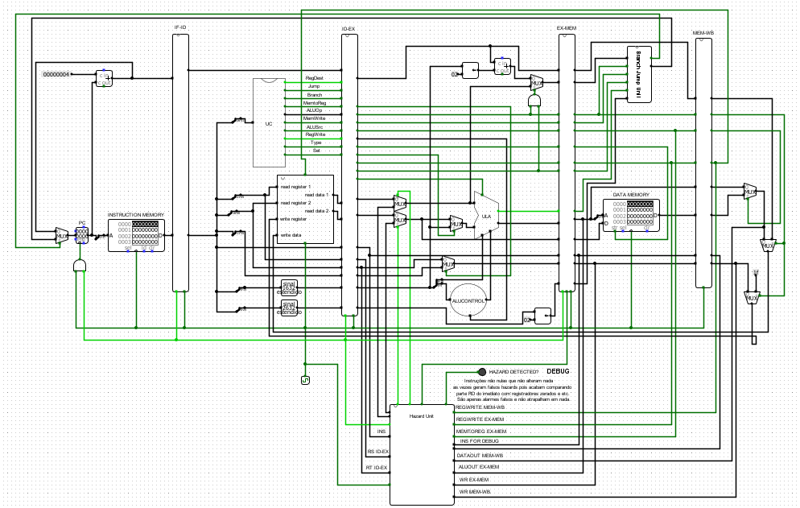

# MIPS-Pipeline
Uma implementação de pipeline com forward e stall em um processador MIPS feito no Logisim.

Um projeto da disciplina de Arquitetura e Organização de Computadores no curso de Ciência da Computação - UFCA.

Docente: Ramon Nepomuceno

Discentes: João Gabriel e Fabricio Elizio

<h3>Modelo de instrução:</h3>

<h4>Tipo R:</h4>
opcode---rs-----rt-----rd----shamt--funct  
000000 00000 00000 00000 00000 000000

<h4>Tipo I:</h4>
opcode---rs-----rt------------imm--------  
000000 00000 00000 0000000000000000

<h4>Tipo J:</h4>
opcode--------------label----------------  
000000 00000000000000000000000000

<h3>Instruções implementadas:</h3>

Opcode 000000:  
Funct 000000 -> ADD | BR[rd] = BR[rs] + BR[rt]  
Funct 000001 -> SUB | BR[rd] = BR[rs] - BR[rt]  
Funct 000010 -> MUL | BR[rd] = BR[rs] * BR[rt]  
Funct 000011 -> DIV | BR[rd] = BR[rs] / BR[rt]  
Funct 000100 -> AND | BR[rd] = BR[rs] AND BR[rt]  
Funct 000101 -> OR  | BR[rd] = BR[rs] OR BR[rt]  
Funct 000110 -> SLL | BR[rt] = BR[rs] << shamt  
Funct 000111 -> SRL | BR[rt] = BR[rs] >> shamt  

Opcode 000001 -> ADDI | BR[rt] = BR[rs] + Imm  
Opcode 000010 -> SUBI | BR[rt] = BR[rs] - Imm   
Opcode 000011 -> MULI | BR[rt] = BR[rs] * Imm  
Opcode 000100 -> DIVI | BR[rt] = BR[rs] / Imm  
Opcode 000101 -> BEQ  | if(BR[rt]==BR[rs]) {PC = Imm} else{ PC=PC+1}  
Opcode 000110 -> JUMP | PC = label  
Opcode 000111 -> LW   | BR[rt] = MD[BR[rs] + Imm]  
Opcode 001000 -> SW   | MD[BR[rs] + Imm] = BR[rt]  
Opcode 001001 -> BNE  | if (BR[rs] != BR[rt]) PC = Imm  
Opcode 001010 -> JAL  | BR[31] = PC + 4; PC = label  
Opcode 001011 -> JR   | PC = BR[rs]   
Opcode 001100 -> SLT  | BR[rd] = (BR[rs] < BR[rt]) ? 1 : 0  
Opcode 001101 -> SLTI | BR[rt] = (BR[rs] < Imm) ? 1 : 0  
